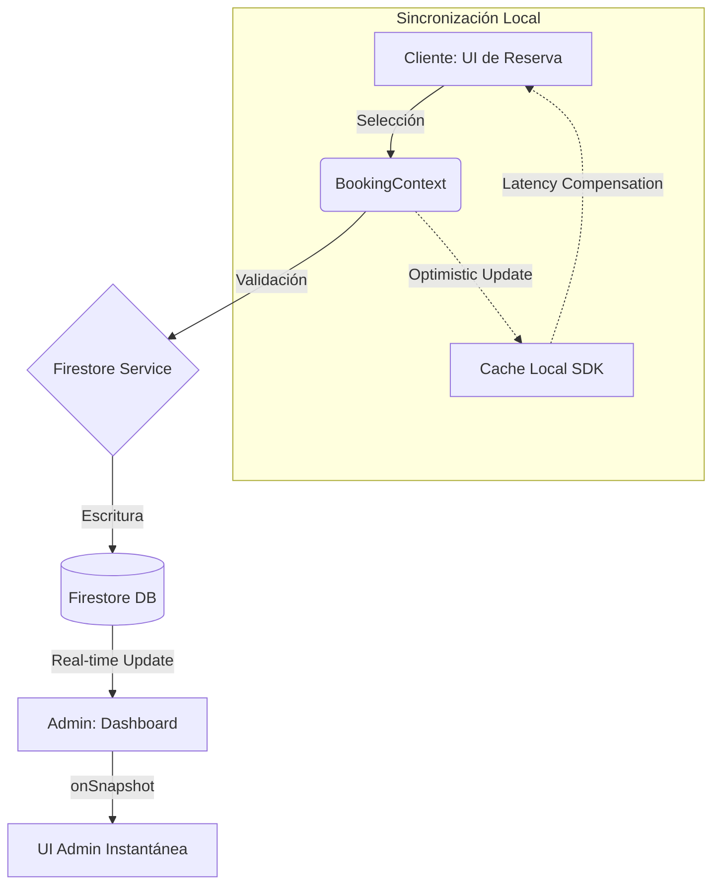

# Olimu BarberShop 💈

Sistema integral de gestión de citas para barberías, desarrollado con **React**, **Tailwind CSS** y **Firebase**. Diseñado para ofrecer una experiencia premium tanto a clientes como a administradores.

## 📂 Estructura del Proyecto

```text
/frontend
├── /public            # Activos estáticos
├── /src
│   ├── /components    # Componentes reutilizables (UI, Layouts)
│   ├── /constants     # Constantes globales (Nombres de colecciones, config)
│   ├── /context       # Gestión de estado global (Auth, Booking)
│   ├── /firebase      # Configuración e inicialización de Firebase
│   ├── /hooks         # Custom hooks (useNotification, useAuth)
│   ├── /pages         # Vistas principales del sistema
│   ├── /services      # Capa de comunicación con Firestore/Auth
│   ├── /styles        # Estilos globales y animaciones
│   └── /utils         # Funciones de utilidad (Formateo, fechas)
├── tailwind.config.js # Configuración del Design System
└── package.json       # Dependencias y scripts
```

## 🔄 Flujo de Datos

El sistema sigue un flujo reactivo y eficiente. A continuación se detalla cómo viaja la información desde el cliente hasta el servidor:



1.  **Captura (UI):** El cliente selecciona un servicio y una fecha en `AppointmentBookingScreen`.
2.  **Validación (Logic):** Se consultan las citas existentes en tiempo real para evitar solapamientos.
3.  **Persistencia (Service):** Los datos viajan a través de `firestoreService.js` hacia las colecciones de Firestore.
4.  **Notificación:** Tras el éxito, se actualiza el `BookingContext` y se dispara una alerta global.
5.  **Administración:** El `Dashboard` escucha cambios en tiempo real (`onSnapshot`) y actualiza las métricas instantáneamente.

## ⚡ Sincronización y Optimistic UI

Para garantizar que la aplicación se sienta "instantánea" y fluida, aprovechamos las capacidades de **Latency Compensation** nativas de Firebase Firestore:

*   **Actualizaciones Locales Inmediatas:** Cuando un administrador cambia el estado de una cita, el SDK de Firestore actualiza la caché local antes de que el servidor confirme la operación. Esto permite que la UI reaccione sin esperar el viaje de ida y vuelta al servidor.
*   **Gestión de Estados Reactivos:** Utilizamos `onSnapshot` para escuchar cambios. Si una operación falla en el servidor, Firestore revierte automáticamente el estado local y nosotros manejamos esa excepción para notificar al usuario.
*   **Booking Flow:** En el flujo de reserva, el `BookingContext` actúa como una "Single Source of Truth", permitiendo transiciones de pantalla sin tiempos de carga innecesarios entre la selección de servicio y la fecha.


## 🛠️ Guía de Buenas Prácticas

Este proyecto implementa los siguientes principios de ingeniería de software:

*   **DRY (Don't Repeat Yourself):** Centralización de operaciones CRUD en la capa de `services`.
*   **SOLID (Responsabilidad Única):** Separación de la lógica de autenticación de la lógica de reserva mediante Contextos independientes.
*   **Clean Code:** Uso de nombres descriptivos, constantes para evitar "strings mágicos" y componentes pequeños y funcionales.
*   **Mobile First:** Diseño responsivo nativo usando utilidades de Tailwind CSS.

## 📖 Diccionario de Firestore

| Colección | Campo | Tipo | Descripción |
| :--- | :--- | :--- | :--- |
| `clients` | `name`, `phone`, `email` | String | Información básica del cliente |
| `appointments` | `clientId` | Reference | Relación con el documento del cliente |
| | `appointmentDate` | String (YYYY-MM-DD) | Fecha de la cita |
| | `status` | String | `pending`, `confirmed`, `completed`, `cancelled` |
| `services` | `name`, `price`, `duration` | String/Number | Catálogo de servicios ofrecidos |
| `settings` | `workingHours` | Object | Configuración de horarios de la barbería |

---

Desarrollado con ❤️ para **Olimu BarberShop**.
